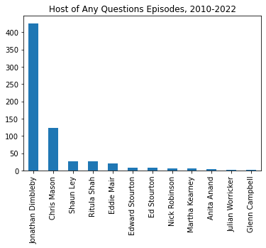
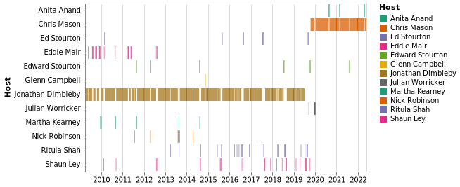

# Any Questions

A repository for some investigation and analysis into the long running, BBC Radio 4 topical discussion program: [Any Questions](https://www.bbc.co.uk/programmes/b006qgvj).

First broadcast in October 1948, it was inteded to run for six editions only, this repository presents research and analysis into over 660 episodes (all of those available on the BBC Website).

## Research Questions

### Where has it been hosted from?

To answer this question, from the data we need to extract where each Any Questions episode is coming from.
Using Spacy, the NLP package for Python, I tried to extract locations from the text. I wrote some code to do this, then audited the first 20 episodes to check it's effectiveness. Below is a table of the problems encountered:

| Index       | Problems |
| ----------- | ----------- |
| 2 | **MISC** swallows **LOC** inside of it |
| 7 | **LOC** is detected as **PER** |
| 11 | **LOC** is not detected |
| 12 | **LOC** is not detected |
| 17 | No **LOC** detected |
| 18 | **MISC** swallows **LOC** inside of it |
| 19 | **LOC** is not detected |
| 20 | **LOC** is detected as **PER** |

As can be seen from the table above, of the first 20 records I audited my code's functioning on; 12 (or 60%) had perfect location information) and the other 8's information wasn't usable. Further complicating this matter is that there is no method of determining what the location should be, no ground truth, which makes this either a very manual task or a technically infeasible one.

The wordlist: ``en_core_web_md`` might have better detection of place, potentially we should combine these for our purposes.

### Who is the most frequent guest?

To answer this question, we need to use Spacy, the NLP package for python, to detect person entities in the body text.
From an brief scan of the body texts for a couple episodes there seem to be one host and 4 guests listed, using this heuristic we might be able to able to improve our accuracy.

I wrote some code to extract names, and then audited the first 20 records to test it's effectiveness. Below is a table of the problems encountered:

| Index       | Problems | Correct Names
| ----------- | ----------- |----------- |
| 0 | **PER** didn't include Lord, Thought Brexit was a **PER** | 4 |
| 1 | **PER** as **ORG** | 4 |
| 3 | Sinn Féin as **PER** | 6 |
| 5 | **ORG** swallows **PER** inside of it | 4 |
| 6 | Wrong **PER**, **LOC**s in **PER** | 2 |
| 7 | **LOC** as **PER** | 5 |
| 8 | **ORG** swallows **PER** inside of it | 4 |
| 9 | **ORG** swallows **PER** inside of it, **LOC** as **PER** | 4 |
| 10 | **PER** didn't include Lord | 5 |
| 11 | **ORG** swallows **PER** inside of it, **PER** too short | 3 |
| 12 | **ORG** swallows **PER** inside of it | 4 |
| 15 | Sinn Féin as **PER**, **PER** not detected | 4 |
| 16 | **ORG** swallows **PER** inside of it | 4 |
| 17 | **ORG** swallows **PER** inside of it, **PER** not detected | 3 |
| 19 | **LOC** as **PER** | 5 |

As can be seen from the table above, of the first 20 records I auited my code's functioning on; 15 (or 75%) had problems to some extent and the other 5 were flawless. This clearly highlights just how difficult the extraction of names from the text is.

### Who has hosted Any Questions?

However the method detailed in the above section, is very good at extracting who hosted the episode - this happened flawlessly for all 20 records, so with this success it makes sense to apply it to the whole dataset and start to draw some conclusions.



|   Host | Number of Episodes |
|:------------------|-------:|
| Jonathan Dimbleby |    426 |
| Chris Mason       |    124 |
| Shaun Ley         |     27 |
| Ritula Shah       |     27 |
| Eddie Mair        |     20 |
| Edward Stourton   |      8 |
| Ed Stourton       |      8 |
| Nick Robinson     |      6 |
| Martha Kearney    |      5 |
| Anita Anand       |      4 |
| Julian Worricker  |      2 |
| Glenn Campbell    |      1 |

Jonathan Dimbleby hosted the program from 1987 to 2019, taking over from John Timpson, in March 2019 he announced that he would "stand down... at the end of June." Shaun Ley, Ritula Shah, Ed Stourton and Julian Worricker served as interim moderators. In October 2019, Chris Mason was announced as Dimbleby's successor.

Below you can see I timeline I have created of who was hosting Any Questions:



## File List

- ```downloader.py``` - Download an episode, might be used later
- ```episode_details.py``` - Get details to all episodes and save it as a .pkl file
- ```analysis.ipynb``` - File for all the analysis we need to perform, using our data collected

## NLP Notes

From the documentation for the Stanford Named Entity Recogniser (NER):

- **MISC**, corresponds to miscellaneous entities, e.g., events, nationalities, products or works of art
- **LOC**, corresponds to location names
- **PER**, corresponds to person names
- **ORG**, corresponds to organisations
